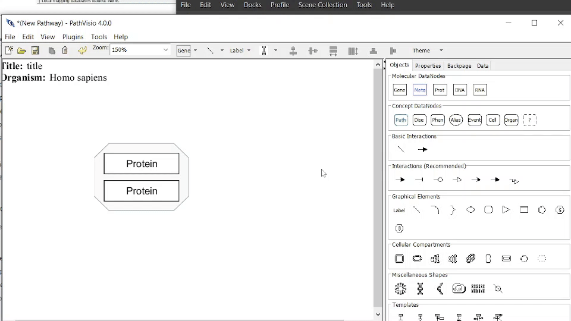
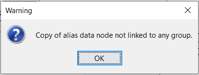

# Aliases
An Alias is a special [type of Data Node](datanodes.html#concept-datanodes) which can represent a [Group](groups.html) pathway element (or other entity). An Alias Data Node can be linked to an existing Group.

## Adding an Alias
Alias Data Nodes can be [added from an existing Group](#adding-and-deleting-an-alias-from-a-group) (linked to the selected group) or [using the Objects Panel](#linking-and-unlinking-an-alias-to-a-group) (link to a group later). 

## Adding and Deleting an Alias from a Group 
### To Add an Alias for an existing Group:
1. Right-click on the Group and select "Add Alias...". The new Alias Data Node will be linked to this Group.  

### To Remove an Alias:
1. To remove an Alias, click on the Alias and delete as normal.

{width=100%}

## Linking and Unlinking an Alias to a Group 

Use the Objects Panel to add a DataNode of type Alias. 

### To Link an Alias Data Node to a Group:
1. Right-click and select "Link to Group..." 
2. Click on to select the Group you wish to link the Alias DataNode

### To Unlink an Alias Data Node from the referenced Group:
1. Right-click and select "Unlink from Group..."

{width=100%}

## Copying and Pasting an Alias
An Alias Data Node can be copied and pasted.

### With linked Group
If both an Alias Data Node and the Group it is linked to are copied, the *new* Alias Data Node will be linked to the *new* Group. 

{width=100%}

### Without linked Group

(\#fig:unnamed-chunk-2)Warning message when copying an Alias (unlinked or copied without group)

If an Alias Data Node is unlinked OR the Alias Data Node is linked to a Group but only the Alias DataNode is copied, the *new* Alias Data Node *will not be linked to any Group*. 

{width=100%}

