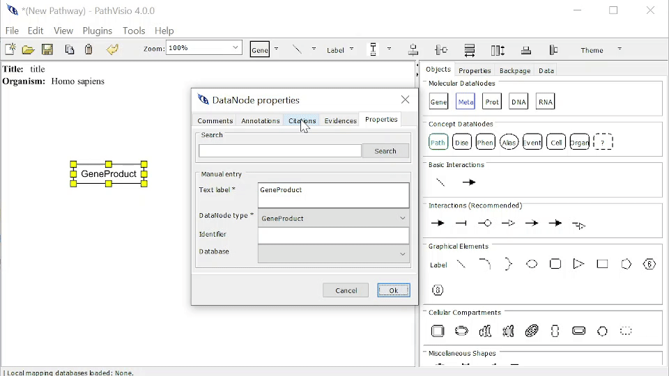
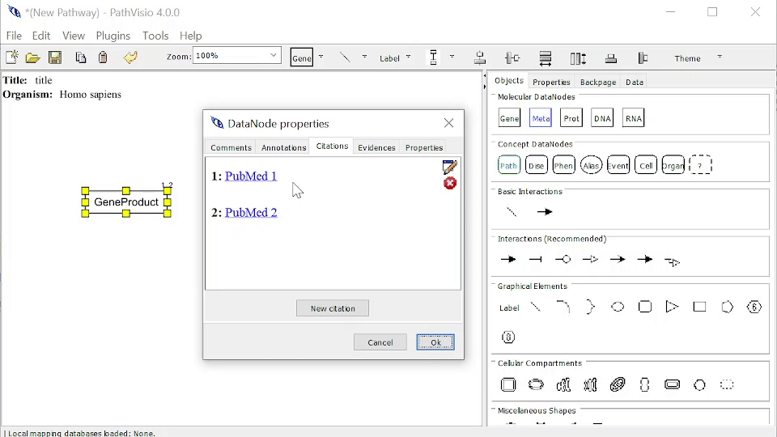

# Citations

A Citation is a reference to a source of information (book, paper, or author, especially in a scholarly work), which you can add to a Pathway Element to provide additional information. 

Required information for a Citation are:

1. Identifier - the identifier for a database for this Annotation.  
2. Database - the database for this Annotation. 

AND/OR 

3. Url link - the url link for this Citation


## Databases/DataSources  

- DOI - Digital Object Identifier is a way to identify content objects on the internet, [info here](https://www.doi.org/)
- ISBN -  International Standard Book Number is a numeric commercial book identifier, [info here](https://isbnsearch.org/)
- ISSN - International Identifier for serials and other continuing resources, in the electronic and print world, [info here](https://www.issn.org/) 
- PubMed - database of references and abstracts on life sciences and biomedical topics, [info here](https://pubmed.ncbi.nlm.nih.gov/)


## Adding a Citation

### From Properties Dialog

You can navigate to the window to add a Citation by: 

1. Double clicking on the Pathway Element.
2. Selecting the Citations Tab.
3. Clicking on "New citation" button.
4. Enter required Citation information (Identifier and Database AND/OR Url link)
5. You can Query/Validate Identifier and Database to check if the citation exists.

{width=100%}

### From Right-Click > Add Reference > Add Citation

You can navigate to the window to add an Citation by: 

1. Right-click on the Pathway Element > Add Reference > Add Citation
2. Enter required Citation information (Identifier and Database AND/OR Url link)
3. You can Query/Validate Identifier and Database to check if the citation exists.

{width=100%}
## Editing a Citation

You can navigate to the Citations Tab Window in two ways: 

1. Double clicking on the Pathway Element and selecting the Citations tab.
2. Right-click on the Pathway Element > Edit Reference > Edit Citations

To Edit a Citation, mouse over that Citation and click on the Blue Edit button. Enter information as normal. 

{width=100%}

## Deleting a Citation

To Delete a Citation, mouse over that Citation and click on the Red Delete button.

{width=100%}

## Nested Annotations (Advanced)

A Citation can contain nested Annotations which are related to or support the current Citation. As of now, PathVisio4 does not have a user interface to support nested References. Advanced users may added nested Annotations *manually* by editing the GPML2021 file in a text editor. 

To add a nested Annotation to the Citation of a Pathway Element, you must do the following:   

1. Add a nested AnnotationRef with elementRef pointing to the elementId of the Annotation. 

```
    <CitationRef elementRef="c0001">
        <AnnotationRef elementRef="a0002" />
    </CitationRef>`
```

2. The Annotation and all its information should be at the end of the GPML, this may also need to be added manually if this Annotation is not already referenced elsewhere in your pathway.

```
<Annotations>
    <Annotation elementId="a0002" name="thyroid cancer" type="Disease">
        <Xref identifier="1781" dataSource="DOID"/>
    	<Url link="https://identifiers.org/DOID:1781"/>
    </Annotation>
</Annotations>
<Citations>
    <Citation elementId="c0001">
        <Xref identifier="7730304" dataSource="pubmed"/>
        <Url link="https://identifiers.org/pubmed:7730304"/>
    </Citation>
</Citations>
```

## 🌐 Related Links and Resources
To learn more about Annotation, Citations, and Evidences in GPML, see [GPML documentation](https://pathvisio.org/documentation/Whats-New-GPML2021.html#streamlined-annotations-citations-and-evidences)


