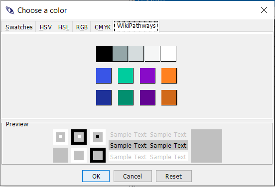

# Color palettes

🎨

* Swatches
* HSV (hue, saturation, value; also known as HSB, for hue, saturation, brightness)
* HSL (hue, saturation, lightness)
* RBG (red, blue, green)
* CMYK (cyan, magenta, yellow, black) 
* WikiPathways (custom/recommended colors from WikiPathways Theme)

## WikiPathways palette

In addition to standard color palettes, PathVisio 4.x also includes a custom color palette for the WikiPathways Theme [Style](https://new.wikipathways.org/style). The WikiPathways theme includes the recommended color scheme for pathway model components. 

WikiPathways palette

(\#fig:unnamed-chunk-2)Example TCA cycle pathway ([WP78](https://www.wikipathways.org/index.php/Pathway:WP78)) drawn using PathVisio and hosted on WikiPathways

