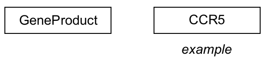
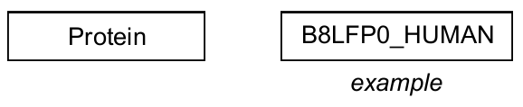
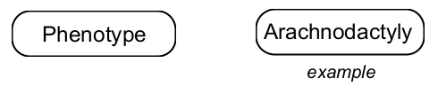
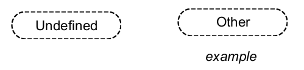

# Data Nodes

A Data Node denotes a biological entity that forms a node in a pathway. We have two categories of Data Node Types: Molecular DataNodes and Concept DataNodes.

(\#fig:unnamed-chunk-2)Object Panel options for Data Nodes

## Molecular DataNodes

### GeneProduct      {width=300}
An entity representing any product of a given gene, including DNA, RNA and Protein. This is the most generic representation of a gene-based biomolecule and is useful when more than one representation might be useful in the given context

### Metabolite      {width=300}
An entity representing a metabolite, including chemical compounds that participate in or are produced by metabolic reactions, but also other chemical compounds that participate in a pathway otherwise.

### Protein      {width=300}
A biomolecular polymer of amino acids, translated from mRNA.

### DNA      {width=300}
An entity representing a DNA polymer. 

### RNA      {width=300}
An entity representing a RNA peptide, including mRNA, miRNA, etc. This is commonly used to explicitly represent mRNA transcripts (excluding DNA or protein forms) or other RNA species, like miRNA, exRNA, lncRNA, etc

### Complex (deprecated)
The Complex Data Node Type is deprecated. Its use was similar to that of [Alias](#alias).  

## Concept DataNodes

### Pathway      {width=300}
A biological process representing a set of interactions and relationships among genes, proteins, metabolites, and other factors in the context of cellular compartments, tissues and organisms.

### Disease      {width=300}

### Phenotype      {width=300}

### Alias       {width=300}
An Alias is a special type of Data Node which can represent a Group pathway element (or other entity). Please see [Aliases](#aliases) for more information!

### Event      {width=300}

### CellNode      {width=300} 

### Organ      {width=300} 

### Undefined      {width=300}
An unspecified biological entity or factor. Should only be used if the type is truly unknown or is different from the ones covered by other data node types.

