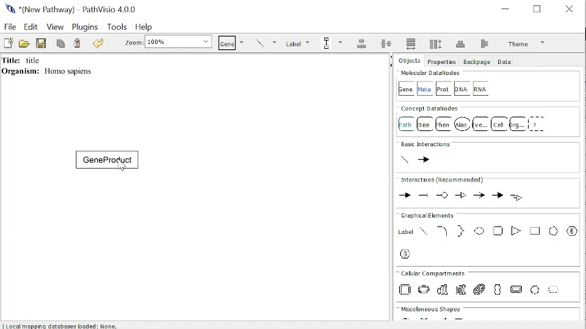

# Annotations

An Annotation is a reference with additional information, which you can add to a Pathway Element to provide additional information. 

Required information for an Annotation are: 

1. Value - the term 
2. Type - the Annotation type 

Optional information for an Annotation are: 

1. Identifier - the identifier for a database for this Annotation.  
2. Database - the database for this Annotation. 
3. Url link - the url link for this Annotation.

## Annotation Types 

- Ontology (e.g.subcellular location)
- Taxonomy (e.g.organism)
- Undefined (other)

## Databases/DataSources 

There are a number of possible DataSources for Annotations. To learn more, please see [BridgeDb](https://bridgedb.github.io/pages/docs.html). 

## Adding an Annotation

### From Properties Dialog

You can navigate to the window to add an Annotation by: 

1. Double clicking on the Pathway Element.
2. Selecting the Annotations Tab.
3. Clicking on "New annotation" button.
4. Enter required Annotation information.

{width=100%}

### From Right-Click > Add Reference > Add Annotation

You can navigate to the window to add an Annotation by: 

Right-click on the Pathway Element > Add Reference > Add Annotation. Then enter required Annotation information.

{width=100%}
## Editing an Annotation

You can navigate to the Annotations Tab Window in two ways: 

1. Double clicking on the Pathway Element and selecting the Annotations tab.
2. Right-click on the Pathway Element > Edit Reference > Edit Annotations.

To Edit an Annotation, mouse over that Annotation and click on the Blue Edit button. Enter information as normal. 

{width=100%}

## Deleting an Annotation

To Delete an Annotation, mouse over that Annotation and click on the Red Delete button.


{width=100%}

## Nested Citations and Evidences (Advanced)

An Annotation can contain nested Citations and/or Evidences which are related to or support the current Annotation. As of now, PathVisio4 does not have a user interface to support nested References. Advanced users may added nested Citations and Evidences *manually* by editing the GPML2021 file in a text editor. 

To add a nested Citations and/or Evidences to the Annotation of a Pathway Element, you must do the following:   

1. Add a nested CitationRef with elementRef pointing to the elementId of the Citation. Add a nested EvidenceRef with elementRef pointing to the elementId of the Evidence

```
<AnnotationRef elementRef="a0001">
  <CitationRef elementRef="c0002" />
  <EvidenceRef elementRef="e0003" />
</AnnotationRef>
```

2. The Citation and/or Evidence and all their information should be at the end of the GPML, this may also need to be added manually if this Citation and/org Evidence is not already referenced elsewhere in your pathway.

```
<Annotations>
  <Annotation elementId="a0001" name="thyroid cancer" type="Disease">
      <Xref identifier="1781" dataSource="DOID"/>
    	<Url link="https://identifiers.org/DOID:1781"/>
  </Annotation>
</Annotations>
<Citations>
    <Citation elementId="c0002">
        <Xref identifier="7730304" dataSource="pubmed"/>
        <Url link="https://identifiers.org/pubmed:7730304"/>
    </Citation>
</Citations>
<Evidences>
    <Evidence elementId="e0003" value="experimental evidence">
        <Xref identifier="0000006" dataSource="ECO"/>
        <Url link="https://identifiers.org/ECO:0000006"/>
    </Evidence>
</Evidences>
```


## 🌐 Related Links and Resources
To learn more about Annotation, Citations, and Evidences in GPML, see [GPML documentation](https://pathvisio.org/documentation/Whats-New-GPML2021.html#streamlined-annotations-citations-and-evidences)


