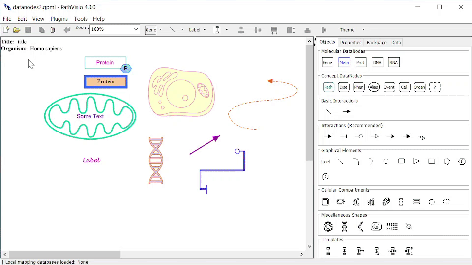

# Make it pretty 

In this section we describe some of the options for customizing the visuals or graphics of your pathway model. 

Pathway elements can be visually customized in a variety of ways!

## Editable properties

### Data nodes, States, Labels, Shapes
Text

* Text Color
* Font Name
* Font Size
* Bold, Italic, Underline, Strikethrough

Shape 

* Shape type: see Shapes section
* Border Color
* Border Style: Solid, Dashed, Double
* Border Width: the thickness of the border
* Fill Color

(\#fig:unnamed-chunk-3)Properties tab when editing a shaped pathway element

### Interactions, Graphical Lines
* Line Color 
* Line Style: Solid, Dashed, Double
* Line Width: the thickness of the line
* Connector Type: Straight, Curved, Elbowed, Segmented

(\#fig:unnamed-chunk-4)Properties tab when editing a line pathway element

### Groups 
Text

* Text Color
* Font Name
* Font Size
* Bold, Italic, Underline, Strikethrough

* Note: groups have default color and shape depending on group type (see Groups section)

(\#fig:unnamed-chunk-5)Group types

## Background color 

In general, a plain white background is recommended for pathway models. 

If desired, background color can be changed by 
1. Clicking on the Title/Organism information box in the upper left corner. 
2. Then in Properties Tab, click on Background Color.

{width=100%}

