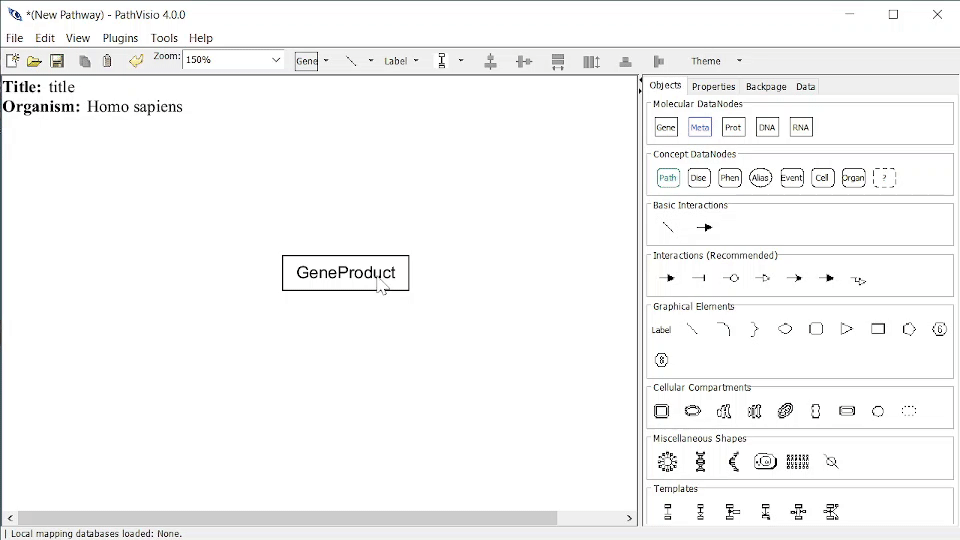

# States

A state represents a specific state of the biological entity (e.g. phosphorylation, genetic variants, etc). A state is linked to a data node.

## Creating or Adding a state 

### To Add a State:
A state must be added to an existing DataNode. To create a State, right click on the DataNode and select > Add State...

### To Remove a State:
1. To remove a State, click on the State and delete as normal. 

Please note that there are several [State types](#state-types) which you may add to a DataNode. 

{width=100%}

## State types 
### Protein Modification
### Genetic Variant
### Epigenetic Modification
### Undefined

