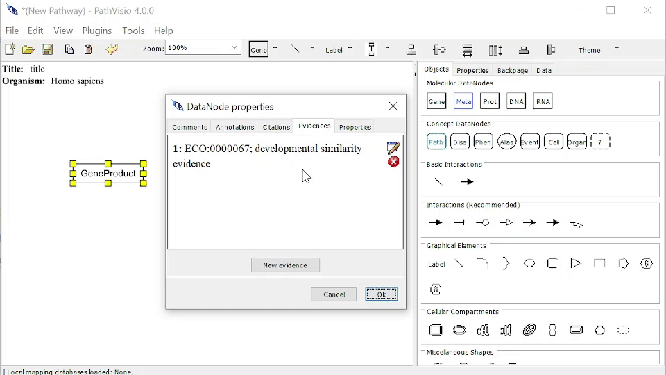
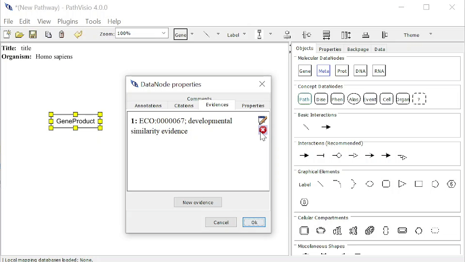

# Evidences

An Evidence provides information on type of scientific evidence, which you can add to a Pathway Element to provide additional information. 

Required information for an Evidence are:

1. Identifier - the identifier for a database for this Annotation.  
2. Database - the database for this Annotation. 

Optional information for an Evidence are: 

1. Term - the term for this evidence in the database
2. Url link - the url link for this Citation

## Databases/DataSources 

The Evidence and Conclusion Ontology (ECO) is the DataSource for Evidences. You can find information about ECO [here](https://www.evidenceontology.org/ ).

## Adding an Evidence

### From Properties Dialog

You can navigate to the window to add an Evidence by: 

1. Double clicking on the Pathway Element.
2. Selecting the Evidences Tab.
3. Clicking on "New evidence" button.
4. Enter required Evidence information.
5. You can Query/Validate Identifier and Database to check if the evidence exists. Term is automatically filled out if evidence exists. 

{width=100%}

### From Right-Click > Add Reference > Add Evidence

You can navigate to the window to add an Citation by: 

1. Right-click on the Pathway Element > Add Reference > Add Evidence
2. Enter required Evidence information.
3. You can Query/Validate Identifier and Database to check if the evidence exists. Term is automatically filled out if evidence exists. 

{width=100%}
## Editing an Evidence

You can navigate to the Evidences Tab Window in two ways: 

1. Double clicking on the Pathway Element and selecting the Evidences tab.
2. Right-click on the Pathway Element > Edit Reference > Edit Evidences

To Edit an Evidence, mouse over that Evidence and click on the Blue Edit button. Enter information as normal. 

{width=100%}

## Deleting an Evidence

To Delete an Evidence, mouse over that Evidence and click on the Red Delete button.

{width=100%}

## 🌐 Related Links and Resources
To learn more about Annotation, Citations, and Evidences in GPML, see [GPML documentation](https://pathvisio.org/documentation/Whats-New-GPML2021.html#streamlined-annotations-citations-and-evidences)

