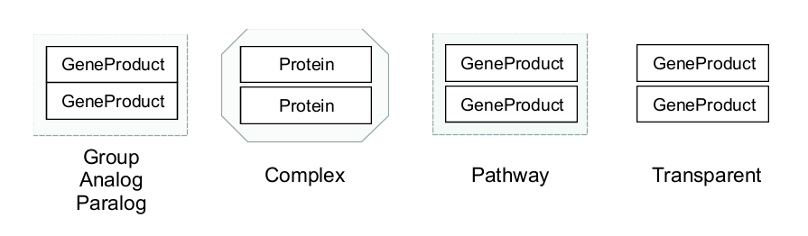

```{r, include=FALSE}
#Load necessary libraries
library(knitr)
```

# Groups

A group is a collection of structurally or functionally similar or related pathway elements.

## Creating and Breaking groups 
To create a group: 

1. Select the pathway elements you would like to group
2. Right click > Create Group
3. Choose the Type of Group you would like to create

To break a group: Right click > Break group

{width=100%}


## Group types

```{r fig.align="center", echo=FALSE, out.width="100%", fig.cap = "Group types"}

```

### Group
A Group is a group of related elements. It is the default group type. 

### Transparent
A Transparent group is a group of related elements. It is similar to the default group type, however its visual/graphics style is transparent. 

### Complex
A Complex is a group of proteins and cofactors forming a protein complex. 

### Pathway
A Pathway in the context of Group Type is a group elements of a pathway

### Analog
An Analog is a group of genes or metabolites with similar function.

### Paralog
A Paralog is a group of related genes in the same species
			
## Add an Alias 
To reference a Group, it is possible to add one or more Alias Data Nodes. An Alias is a special type of Data Node which can represent a Group (or other entity). Please see [Aliases](#aliases) for more information.  


