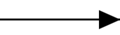
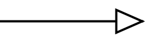
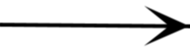
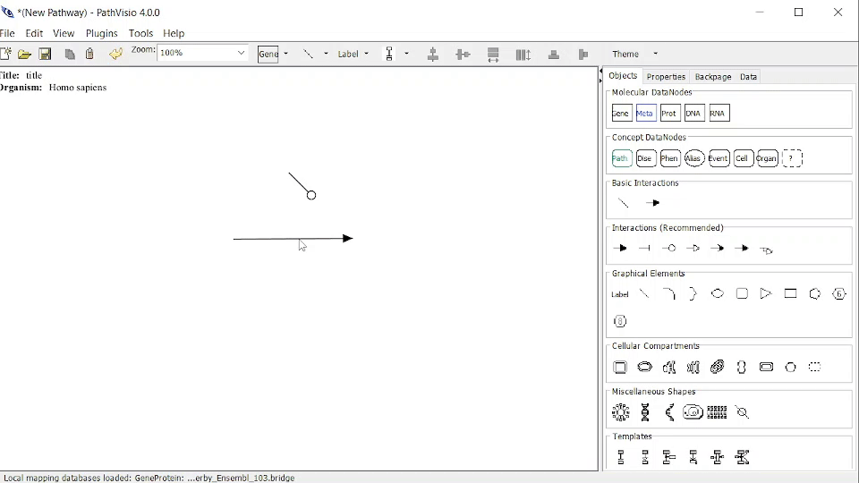
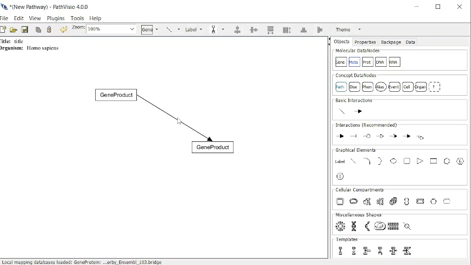
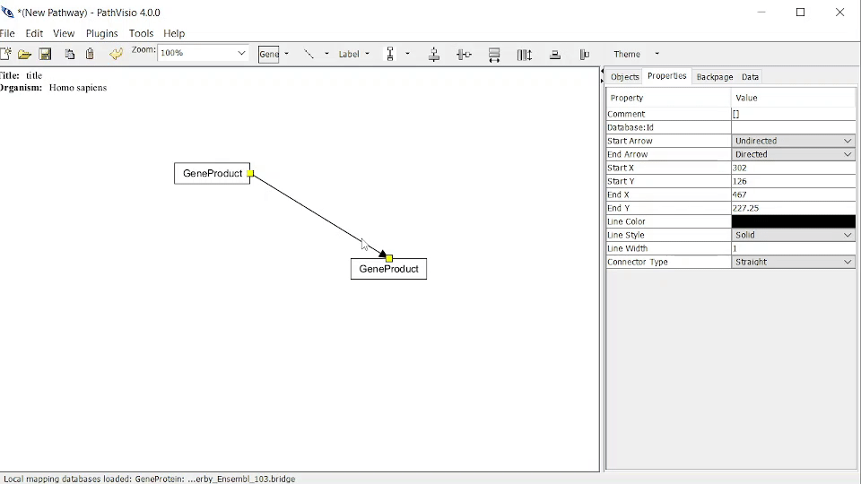

# Interactions

An interaction represents the biological relation between entities. 

An Xref can be specified for Interactions (in contrast to GraphicalLines).

(\#fig:unnamed-chunk-1)Object Panel options for Interactions

## Basic interactions

### Directed      {width=100}

### Undirected      {width=100}

## Interactions (Recommended)

### Conversion      {width=100}	 	
mim-conversion; mim-modification; mim-cleavage; mim-gap; mim-branching-left; mim-branching-right

### Inhibition      {width=100}
TBar	mim-inhibition

### Catalysis      {width=100}
mim-catalysis

### Stimulation      {width=100}	 	
mim-stimulation; mim-necessary-stimulation

### Binding      {width=100}		 	
mim-binding; mim-covalent-bond

### Translocation      {width=100}		 	
mim-translocation

### Transcription-translation      {width=100}	
mim-transcription-translation

## Adding an Anchor
An anchor is a connection point on a graphical line or an interaction, where another graphical line or interaction can be connected.

To add an anchor: 

1. Right-click on the line > Add Anchor

{width=100%}

## Changing ConnectorType
The connector type specifies a set of rules to govern layout of lines, e.g. Straight (default), Elbow...

To change connector type: 

1. Right-click on the Line > Connector Type > select a new type
2. Or select the Line, go to Properties Panel and change Connector Type using drop down menu 

{width=100%}

## Adding Waypoints (ConnectorType = "Segmented")
Waypoints can be added to a graphical line or an interaction of Segmente ConnectorType. 

To add waypoints: 

1. Line must have Connector type "Segmented"
2. Right-click on the Line > Add Waypoint

{width=100%}

