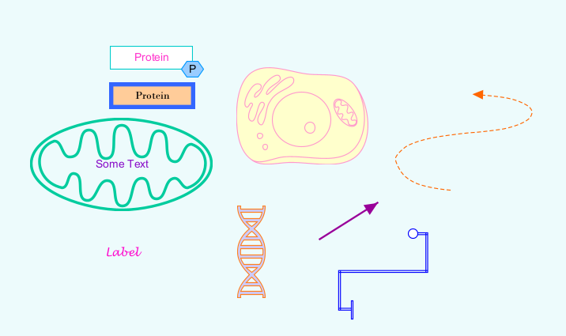
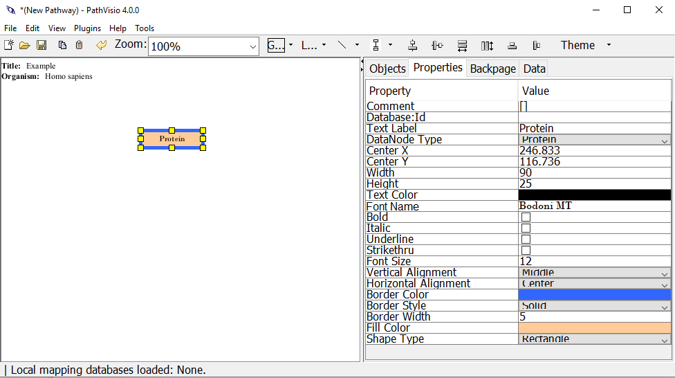
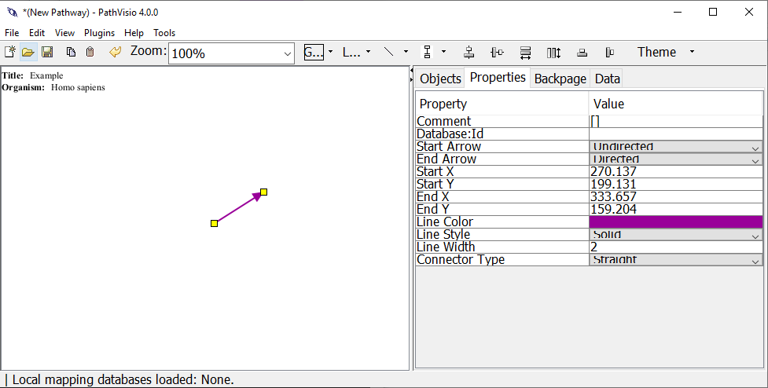

```{r, include=FALSE}
#Load necessary libraries
library(emojifont)
library(knitr)
```

# Make it pretty 

In this section we describe some of the options for customizing the visuals or graphics of your pathway model. 

Pathway elements can be visually customized in a variety of ways!


```{r fig.align="center", echo=FALSE, out.width="100%"}

```

## Editable properties


### Data nodes, States, Labels, Shapes
Text

* Text Color
* Font Name
* Font Size
* Bold, Italic, Underline, Strikethrough

Shape 

* Shape type: see Shapes section
* Border Color
* Border Style: Solid, Dashed, Double
* Border Width: the thickness of the border
* Fill Color

```{r fig.align="center", echo=FALSE, out.width="100%", fig.cap = "Properties tab when editing a shaped pathway element"}

```

### Interactions, Graphical Lines
* Line Color 
* Line Style: Solid, Dashed, Double
* Line Width: the thickness of the line
* Connector Type: Straight, Curved, Elbowed, Segmented


```{r fig.align="center", echo=FALSE, out.width="100%", fig.cap = "Properties tab when editing a line pathway element"}

```

### Groups 
Text

* Text Color
* Font Name
* Font Size
* Bold, Italic, Underline, Strikethrough

* Note: groups have default color and shape depending on group type (see Groups section)
```{r fig.align="center", echo=FALSE, out.width="100%", fig.cap = "Group types"}
knitr::include_graphics("images/screenshots/group-types.png")
```

## Background color 

In general, a plain white background is recommended for pathway models. 

If desired, background color can be changed by 
1. Clicking on the Title/Organism information box in the upper left corner. 
2. Then in Properties Tab, click on Background Color.

{width=100%}


