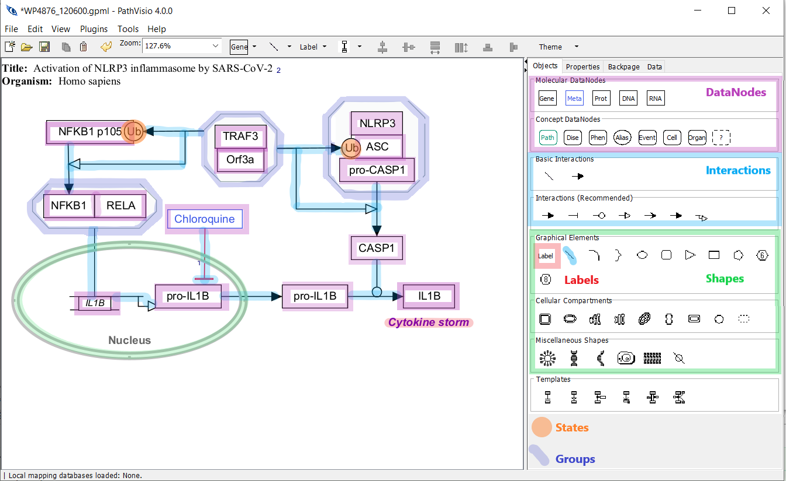

# Pathway elements {#pathway-elements}

Here we describe some of the commonly used terminology and concepts used in PathVisio, libGPML, GPML, and WikiPathways. 

The main components of a pathway model are referred to as **Pathway Elements**. 

(\#fig:unnamed-chunk-2)PathVisio4 user interface, with open pathway WP4876. In this diagram, we color DataNodes (Purple), States (Orange), Interactions/Graphical Lines (Light Blue), Lables (Red), Shapes (Green), and Groups (Dark Blue).

* [DataNodes](data-nodes.html) - denotes a biological entity that forms a node in a pathway.
  * [Aliases](aliases.html) - special data node type.
* [States](states.html) - represents a specific state of the biological entity (e.g. phosphorylation, genetic variants, etc). A state is linked to a data node.
* [Interactions](interactions.html) - represents the biological relation between entities. 
* [Graphical Lines](graphical-lines.html) - a visual annotation without semantic meaning. It is often used to partition space or connect other pathway elements. 
* [Labels](labels.html) - a text field which can be used to annotate any aspect of a pathway
* [Shapes](shapes.html) - a visual annotation or graphical element.
* [Groups](groups.html) - a collection of structurally or functionally similar or related pathway elements.

