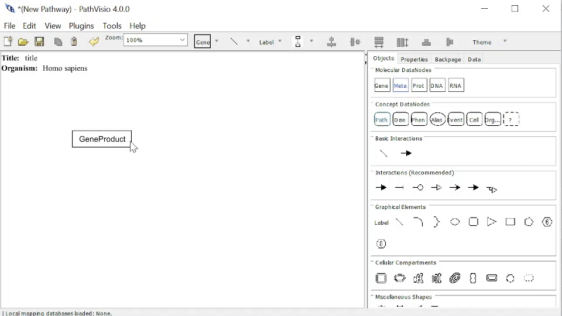

# Properties

In this section we discuss Properties which add information to the Pathway or Pathway Elements, rather than Graphical/Style properties such as Line color, line width, etc. 

For the Pathway and Pathway Elements, you can edit the Properties. Properties can be accessed and edited one of two ways: 

1. Double clicking on Pathway (InfoBox in top left corner) or Pathway Element, a dialog will open on the Properties tab.
2. Or selecting the Pathway (InfoBox in top left corner) or Pathway Element and navigating to the Properties Panel (right side).

## Pathway (InfoBox)

* Title (required)
* Organism (required)
* Description
* Identifier and Database
* Also see [meta-information](pathway-meta-information.html)

## DataNode
* Text label (required)
* DataNode type (required) 
* Identifier
* Database

## State 
* Text label
* State type (required) 
* Identifier and Database

## Interaction
* Start arrow (required) 
* End arrow (required) 
* Identifier and Database

## GraphicalLine
N/A

## Label
* Text label (required) 
* Hyperlink 

## Shape
* Text label

## Group
* Text label
* Group type (required) 
* Identifier and Database

## Identifier and Database
In GPML, Identifier and Database/DataSource information is stored in the Xref element. An Xref is a a reference from an instance of a class in this ontology to an object in an external resource. 

The following Pathway Elements can have an Identifier and Database (Xref): 

* DataNode
* State
* Interaction
* Group 

There are various Databases available depending on the specific type of Pathway Element and/or Type. For example, Interactions have a specific set of suitable Database. And DataNode of Type "Pathway" will also have specific Databases. 

### Adding Identifier and Database Manually
To add Identifier and Database information: 

1. Navigate to the Properties Tab of the Pathway Element.
2. Select a Database.
3. Enter an Identifier.
4. Enter Text label.

{width=100%}

### Adding Identifier and Database using Search (DataNode)
To add Identifier and Database information by Search: 

1. [Load Identifier Mapping Database](load-identifier-mapping-database.html), if not done so already
2. Navigate to the Properties Tab of the Pathway Element.
4. Enter an Identifier or Name and click Search.
5. Select desired item from search Results, this will automatically populate the fields. 

{width=100%}

