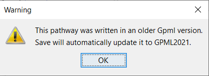

```{r, include=FALSE}
#Load necessary libraries
library(emojifont)
library(knitr)
```

# Saving your pathway model

## Graphical Pathway Markup Language (GPML)

Graphical Pathway Markup Language ([GPML](https://pathvisio.org/documentation/GPML)) is the native file format used store and edit pathway models in [PathVisio](https://pathvisio.org) and share them on [WikiPathways](https://www.wikipathways.org/index.php/WikiPathways).

The current GPML version used is **GPML2021**. 

Please note that PathVisio 4.0.0 (which uses libGPML) works with GPML version 2021 and 2013a. When a pathway model written in GPML2013a is opened in PathVisio 4.x it will be ***automatically*** converted into GPML2021 when saved. 

```{r fig.align="center", echo=FALSE, fig.cap = "Warning message when opening an older GPML2013a file"}

```

To save a pathway model as GPML2013a format, please export it as GPML2013a format: File > Export 

## PathVisio File Formats
Default file format is GPML2021

* GPML file (.gpml, .xml)

Pathway models can be exported into the following other formats

* GPML2013a file  (.gpml, .xml)
* PDF (.pdf)
* PNG (.png)
* SVG (.svg)
* DataNode list (.txt)
* Eu. Gene pathway (.pwf)

## `r emoji("globe_with_meridians")` Resources

* [Documentation for GPML](https://pathvisio.org/documentation/GPML)) 
* ...
* ...
