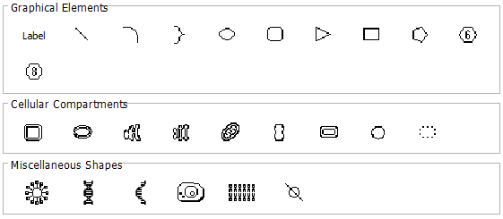
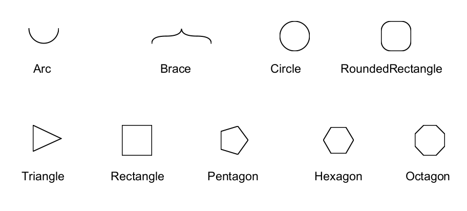
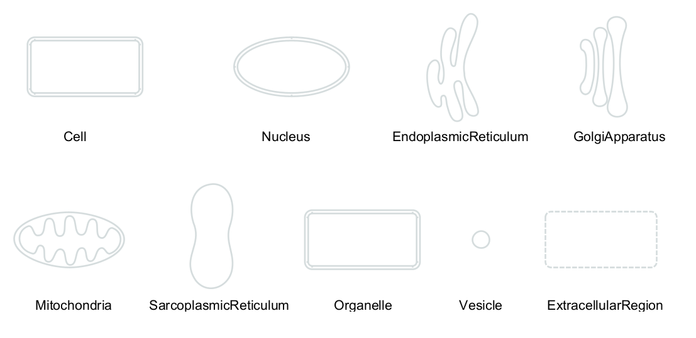
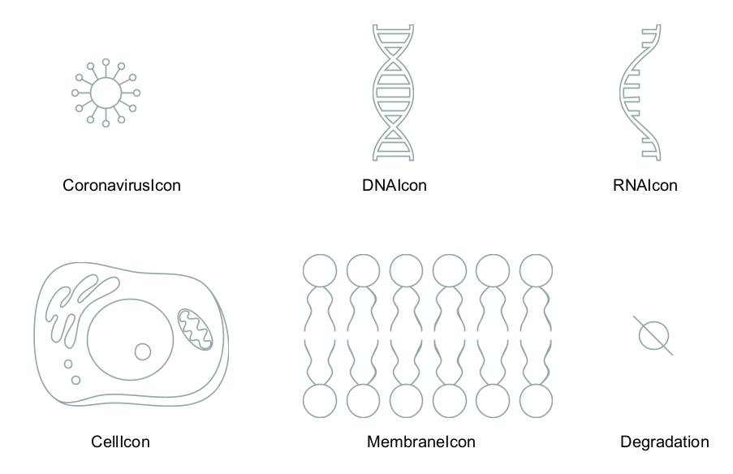

```{r, include=FALSE}
#Load necessary libraries
library(knitr)
```

# Shapes

A shape is a visual annotation or graphical element.

```{r fig.align="center", echo=FALSE, out.width="70%"}

```

<style>
    pre {
        border: 0;
    }
</style>

## Basic Shapes
```{r fig.align="center", echo=FALSE, out.width="80%"}

```


## Cellular Compartments
```{r fig.align="center", echo=FALSE, out.width="100%"}

```

## Miscellaneous Shapes
```{r fig.align="center", echo=FALSE, out.width="90%"}

```
