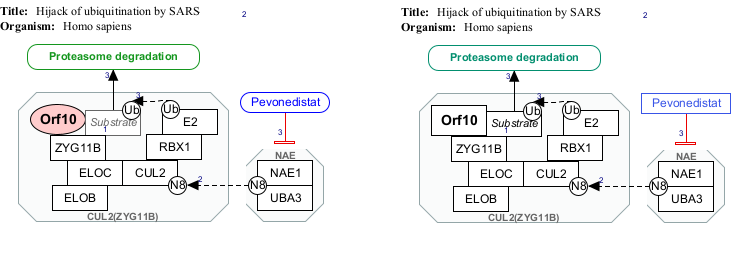

# Themes

A theme is a predefined combination of colors and shapes (for data nodes). Themes can be applied to pathway models, allowing for a quick and easy way to change the look of your pathway model. 

### Some things to consider

* Applying a theme may cause undesired changes. 
* Users may choose to "Preview" a theme before applying it. 
* Immediately after a theme is applied, it can still be removed with "Undo". 
* A user may need to further manually edit their pathway model to achieve the desired look. 
* Users are free to choose their own colors, but please be aware of the recommended default colors and shapes for data nodes.  

## WikiPathways Theme
The WikiPathways Theme is the recommended theme for pathway model components (especially data nodes) and is created from the colors defined on the WikiPathways Website [Style](https://new.wikipathways.org/style). These colors are always also in the WikiPathways Palette, see Color Palettes. 

When the WikiPathways Theme is applied to a pathway model, data node graphics color and shape type are set to their default values!   

Molecular data nodes are rectangles
Concept data nodes are rounded rectangles (except for Alias data nodes)

(\#fig:unnamed-chunk-2)default color(text, border, and fill) and shape of data nodes according to WikiPathways Theme

## Applying a Theme

You can apply a theme from the menu bar Theme button or Tools > Apply Theme.

{width=100%}

In the figure below, we see the pathway [Hijack of ubiquitination by SARS-CoV-2 (Homo sapiens)](https://www.wikipathways.org/index.php/Pathway:WP4860#nogo2) for which the WikiPathways Theme was applied - before on the left, after on the right. 

(\#fig:unnamed-chunk-3)Pathway before (left) and after (right) WikiPathways Theme is applied

The resulting Blue (metabolite), Green (Pathway), and Gray (Group) are slightly different as they are the particular shades defined by WikiPathways [Style](https://new.wikipathways.org/style). The original blue, green, and gray colors are typical of Pathvisio 3.x. While in PathVisio 4.x the new default colors match WikiPathways. 

In the case of the **Orf10** protein, the creator of this pathway had originally chosen a round pink shape to indicate that this protein of SARS-CoV-2 rather than Homo Sapiens. However, the WikiPathway Theme defines data nodes of type protein as black rectangles. To recover the appearance of **Orf10**, the creator may choose to further manually edit the pathway model. 

Another change is the shape of **Pevonedistat** from rounded rectangle to rectangle, because it is of data node type Metabolite. 

